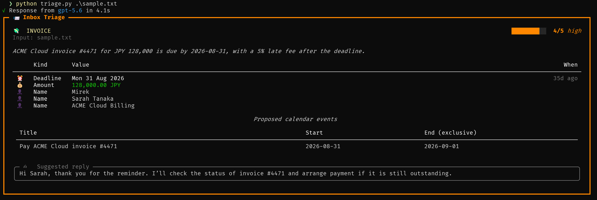
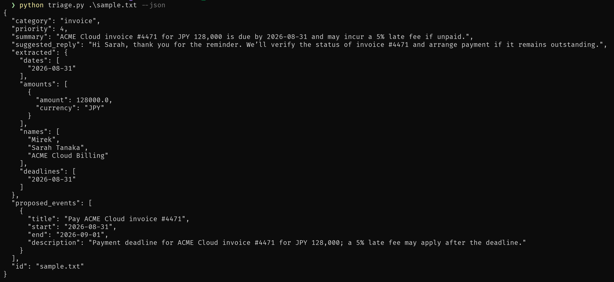
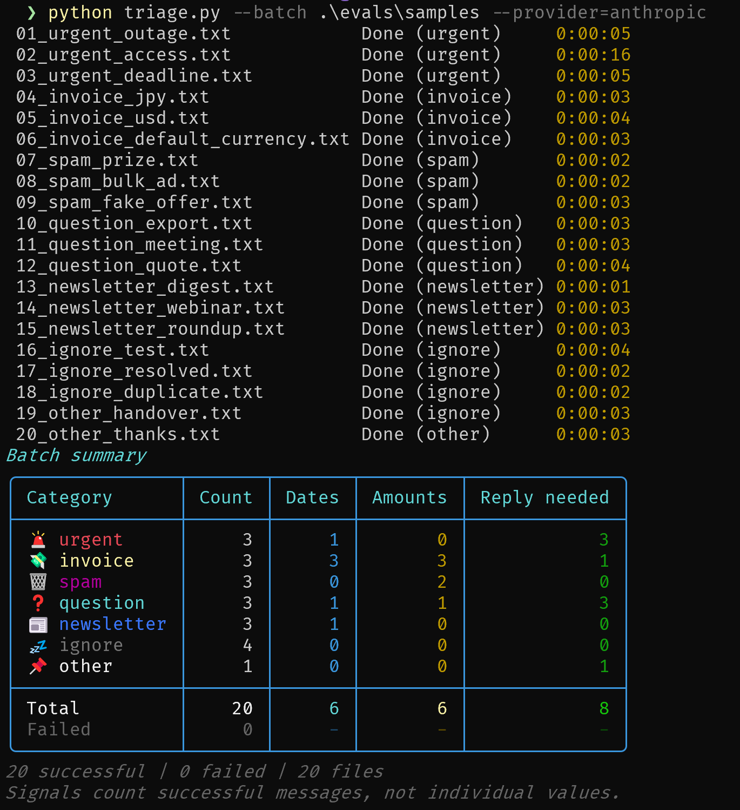
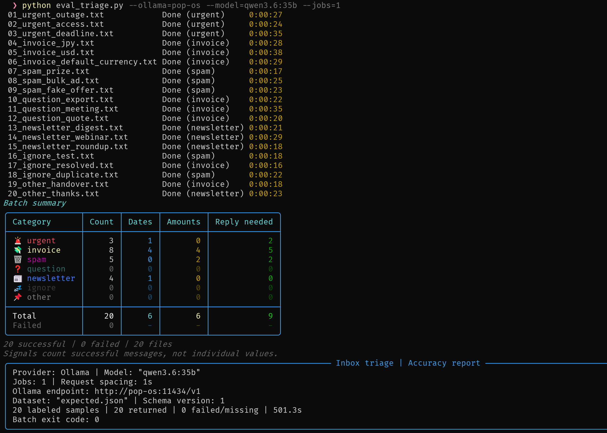
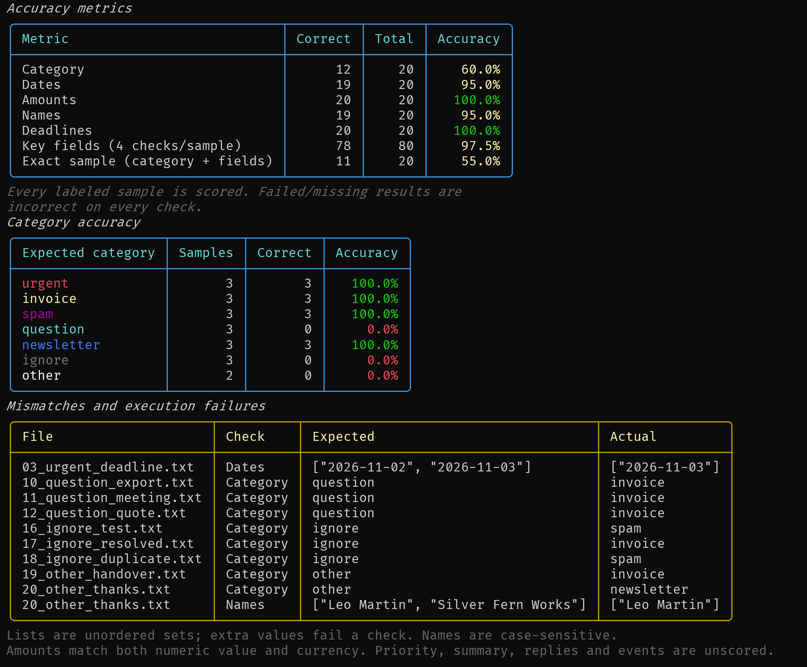

# 📨 LLM Inbox Triage

A small, practical LLM assistant that takes raw text (an email, a support ticket, a message) and returns a **structured analysis**: category, priority, one-line summary, a suggested reply draft, and extracted data (dates, amounts, names, deadlines) as clean JSON.

Built as **Project 1** on my path to becoming an LLM/GenAI Engineer — a focused way to learn LLM APIs, structured output, prompt engineering, and multi-provider code in one useful tool.

```bash
python triage.py sample.txt
python triage.py sample.txt --provider anthropic
```

**Now included:** OpenAI, Anthropic, and local Ollama models; throttled batch
processing with a signal summary; and a standalone evaluator with 20 labeled
samples and detailed accuracy reporting.

[Model selection and Ollama](#model-selection-and-ollama) |
[Batch processing](#batch-processing-7) |
[Quickstart](#-quickstart) |
[Evaluation harness](#evaluation-harness-8)

### Single-file output

Without `--json`, the terminal card shows the category, priority, extracted
fields, proposed calendar events, and suggested reply:



For machine-readable output, add `--json`; use `--out` to save it as well:

```powershell
python triage.py .\sample.txt --json
python triage.py .\sample.txt --json --out .\out\sample.out.json
```



### Model selection and Ollama

Both CLIs accept `--model NAME` to override the selected provider's model.
Without it, OpenAI and Anthropic retain their existing defaults:

```powershell
python triage.py sample.txt --provider openai --model gpt-5.6
python triage.py sample.txt --provider anthropic --model claude-sonnet-5-5
python eval_triage.py --provider anthropic --model claude-sonnet-5-5
```

Use `--ollama HOST` instead of `--provider` to call an Ollama daemon's
OpenAI-compatible endpoint. These options are **mutually exclusive**, including
an explicit `--provider openai`. Ollama **requires `--model`**, since available
models depend on the host:

```powershell
python triage.py sample.txt --ollama=pop-os.local --model qwen3.6:35b
python triage.py --batch .\evals\samples --ollama=pop-os.local --model qwen3.6:35b --json
python eval_triage.py --ollama=pop-os.local --model qwen3.6:35b
python eval_triage.py --ollama=pop-os.local --model qwen3.6:35b --jobs 1
```

Use `--jobs 1` to process evaluation samples **one at a time**. This controls
concurrent requests, not the Ollama model's internal CPU/GPU threads. The default
minimum request-start interval remains 1 second; change it with
`--request-interval SECONDS`.

A bare hostname/IP defaults to `http://HOST:11434/v1`. Optional ports and
HTTP(S) URLs with an optional `/v1` suffix are accepted; omitted ports still
default to 11434. IPv6 addresses are supported (bracket them when specifying
a port), for example `--ollama="[::1]:11434"`. URL credentials, query strings,
fragments, and non-`/v1` paths are rejected.

Ollama uses async OpenAI-compatible **chat completions** with a JSON-schema
response format and Pydantic validation, not the cloud Responses API. The local
model/server must support structured outputs; invalid output or unsupported
models/formats are reported explicitly without falling back to free-form text
or another provider. No OpenAI API key is needed: the SDK receives a dummy
`ollama` key, which an ordinary local Ollama daemon ignores. This targets daemon
hosts, not Ollama's direct cloud service, which does not currently support
structured outputs.

Model overrides and Ollama work with file/stdin input, batching, throttling,
retries, and optional calendar creation. The evaluator forwards the chosen
backend and model and includes both in its report.

### Batch processing (#7)

Use `--batch <dir>` to process every `.txt` file directly in a directory
(case-insensitive extension; subdirectories and other file types are skipped):

```powershell
python triage.py --batch .\messages
python triage.py --batch .\evals\samples --json
python triage.py --batch .\messages --provider anthropic --jobs 2 --request-interval 2
python triage.py --batch .\messages --json --out .\reports\messages.json
```

`--batch` requires a directory argument and cannot be combined with the positional
input `path`, in either order. Without `--batch`, file input works as before;
omitting both `path` and `--batch` reads stdin.

Batch processing defaults to **3 concurrent workers** and **at least 1 second
between AI request starts**, including retries. `--jobs` accepts a positive
integer and `--request-interval` a finite positive number of seconds; both
options require `--batch`. Transient errors retain the existing exponential
backoff and bounded `Retry-After` handling. These are request-rate controls,
not token quotas: tune them for your provider/model's limits. Each SDK client
is closed after its request/retry sequence.

Initially up to **15 file-status rows** are visible (queued, waiting for AI,
done, or failed). Each completed or failed file reveals one additional row
until all filenames are displayed. Completed rows stay visible, so the display
grows gradually rather than showing the entire batch immediately. This does
not change API concurrency. A counts-per-category summary follows on **stderr**.
The summary uses category colors and icons (plain labels on legacy encodings),
highlights failures, and includes
per-category and overall counts for **Dates**, **Amounts**, and **Reply needed**.
Each signal counts successful messages, not individual extracted values:
dates include deadlines, amounts count nonempty extracted amount lists, and
reply needed means a nonblank `suggested_reply`. Failed files have unknown
signals (shown as `-`) and are excluded from signal totals.
Without `--json`, batch mode prints no individual triage cards; its console
output is limited to status lines and the summary table (plus any error messages).



These remain visible with `--json`; stdout contains only one JSON document.
For redirected/noninteractive stderr, Rich prints the final status rows.
On Windows with stdout piped (including the evaluator), live redraw uses the
actual stderr terminal's ANSI support rather than Rich's stdout-based legacy
renderer. If that terminal cannot support redraw, a warning is printed and
only final status rows are shown, avoiding repeated blocks.
Successful results and errors are ordered by filename, not completion time.

Batch mode always saves **one aggregate JSON**, by default to
`out/<directory-name>.out.json`; existing output is overwritten. `--out PATH`
overrides the destination and may be used without `--json` in batch mode.
`--json` additionally prints the same document to stdout. This intentionally
replaces issue #7's one-JSON-per-input output:

```json
{
  "results": [
    {
      "id": "message.txt",
      "category": "question",
      "priority": 2,
      "summary": "A question about exporting records.",
      "suggested_reply": null,
      "extracted": {"dates": [], "amounts": [], "names": [], "deadlines": []},
      "proposed_events": []
    }
  ],
  "errors": [
    {"id": "unreadable.txt", "error": "Cannot read unreadable.txt: Access denied"}
  ]
}
```

An unreadable/empty message, API failure, or calendar failure is recorded in
`errors` and does not stop other files. Any per-file failure makes the command
exit with code **1**; all-success batches exit **0**. Invalid or empty directories
fail explicitly before any requests. An output-file write failure also exits 1;
with `--json`, the aggregate remains available on stdout. Interruption exits 130
and does not write a partial aggregate.

`--create-events` also works in batch mode. AI analysis is concurrent but calendar
authorization/writes are serialized. Each successful result includes its own
`calendar_events` list when enabled. Calendar writes are not retried; an error
may leave events already created. Check your calendar before rerunning. Deduplication
is per input message, not across messages or separate runs.

### Result IDs

Every exported `TriageResult` now requires `id: str`. For file input this is the
filename, **including its extension**, not a full path. For stdin it is the
literal `***stdin***`. IDs are assigned by the application, never by the model.
The provider functions return a validated `TriageAnalysis`; the CLI adds the
source ID to create the final `TriageResult`. Callers constructing or loading
older `TriageResult` objects must supply the source ID themselves.

`create_calendar_entry(calendar, title, start, end, description="", access_token=None)`
is also available for callers that want to create an event in Google, Me, or
Hotmail/Outlook Calendar. Use the `Calendar` enum (`Calendar.google`, `Calendar.me`,
or `Calendar.hotmail`); existing string backend names remain accepted for
compatibility. Supply timezone-aware `datetime` values (or `date`
values for Google/Me all-day events, with an exclusive end date) and an OAuth
access token, either directly or through `GOOGLE_CALENDAR_ACCESS_TOKEN` or
`HOTMAIL_CALENDAR_ACCESS_TOKEN`. Google can also obtain and refresh tokens
automatically as described below. The CLI calendar backend defaults to Google;
Google and Me are supported by the CLI automatic-creation workflow.

### Model-selected calendar events (#6)

```powershell
python triage.py sample.txt --create-events
python triage.py sample.txt --provider anthropic --create-events --calendar google
python triage.py sample.txt --create-events --json --out
python triage.py sample.txt --create-events --calendar me
```

`--create-events` authorizes calendar writes **without confirmation**. Without
this flag, triage behaves as before and never requests calendar authorization.
`--calendar` defaults to `google`; specifying the backend alone does not enable
writes.

The first structured triage includes a `proposed_events` list. The model selects
actionable meetings, appointments, and deadlines and supplies their `title`,
`start`, `end`, and `description`, or returns an empty list when none are appropriate.
These proposals are returned even without `--create-events`, so you can inspect
them in JSON or the terminal card before opting into writes. Dates without a complete time range and timezone
are represented as all-day events, with an exclusive end date.

With `--create-events`, a shared provider-independent `create_events(result)`
function validates and creates the first triage's proposals directly. Start dates
must belong to the extracted dates/deadlines, and the entire batch is validated
before any writes. The raw message is not analyzed again: there are **no additional
LLM selection, tool-calling, or acknowledgement requests**.

With `--create-events --json`, stdout and `--out` include an additional
`calendar_events` list containing each created event's `id`, `title`, `start`,
`end`, `description`, and `url`. Without `--create-events`, the JSON shape is
unchanged apart from the new `proposed_events` field. No proposals means no
calendar authorization or calendar requests. Older saved triage results without
`proposed_events` default to an empty list; when loading them as `TriageResult`,
supply the newly required source `id` as described above.

Identical proposals are deduplicated within a run, but separate runs
can create duplicates. Calendar writes are not automatically retried because
a lost response may mean the event was already created. If a run fails after
creating events, inspect your calendar before rerunning.

### Google Calendar authorization

1. Enable the Google Calendar API in your Google Cloud project and configure
   the OAuth consent screen. If the app is in testing, add your account as a
   test user.
2. Create a **Desktop app** OAuth client and download its credentials JSON.
   Keep this file outside the repository.
3. Set its path in PowerShell (or in your gitignored `.env`):

   ```powershell
   $env:GOOGLE_CALENDAR_CLIENT_SECRETS_FILE = 'C:\path\to\client_secret.json'
   ```

4. Call the function without `access_token`:

   ```python
   from datetime import datetime, timedelta, timezone
   from dotenv import load_dotenv
   from triage import Calendar, create_calendar_entry

   load_dotenv()  # Needed when calling directly and using .env
   start = datetime.now(timezone.utc) + timedelta(days=1)
   event = create_calendar_entry(
       Calendar.google, "Planning meeting", start, start + timedelta(hours=1)
   )
   print(event["id"])
   ```

The first call opens a browser for sign-in and consent to the
`https://www.googleapis.com/auth/calendar.events` scope. Authorization has a
three-minute timeout. Tokens are stored in Windows Credential Manager, macOS
Keychain, or Linux Secret Service, **not** in a plaintext file. The OS credential
store must be available/unlocked; there is no plaintext fallback.

Later calls reuse a valid token or refresh it without opening the browser.
An explicit token or `GOOGLE_CALENDAR_ACCESS_TOKEN` takes precedence over OAuth;
remove that override to use automatic refresh.

To authorize without creating an event, call
`get_google_calendar_access_token()` from `google_calendar_auth`. To replace
revoked credentials or switch Google accounts, call
`get_google_calendar_access_token(reauthorize=True)`. The cache is per OAuth
client, with one authorized Google account per client. Failed sign-in or refresh
raises a descriptive error instead of silently retrying in a browser.

Google may expire refresh tokens (including after seven days for external
testing-mode apps using calendar scopes), or users may revoke access; those
cases require sign-in again. Hotmail/Outlook automatic OAuth is not implemented:
continue supplying its access token.

### Me Calendar authorization

The Me integration follows the provided desktop example: browser authorization
code flow with PKCE, a loopback `/callback`, and the `/calendar/v1` REST API.
Set the service address and CA certificate path in PowerShell or your `.env`:

```powershell
$env:ME_BASE = 'https://pop-os.local'
$env:ME_CA_FILE = 'C:\path\to\me-calendar-example\caddy-root.crt'
python triage.py sample.txt --create-events --calendar me
```

The certificate stays outside the repository. HTTPS certificate and hostname
verification remain enabled. Without `ME_CA_FILE`, the service must have a
certificate trusted by your system. `ME_CLIENT_ID` defaults to `me-desktop`;
the auth service must register that client with the loopback redirect
`http://127.0.0.1/callback`. Sign-in has a five-minute timeout. The loopback
server handles connections concurrently, so Edge/Chrome preconnections that
send no data cannot block the actual OAuth callback. Idle connections time out
after ten seconds, and the listener shuts down on success, timeout, or failure.

Access tokens are cached in the same native OS credential store as Google
credentials. Me's example documents a 15-minute token lifetime; an `expires_in`
value returned by the service takes precedence. The example provides no refresh
flow, so an expired token requires a new browser sign-in. `ME_ACCESS_TOKEN`
is an optional override and disables automatic sign-in while it is set.
If authorization is revoked before the cached token expires, use
`get_me_calendar_access_token(MeConfig.from_environment(), reauthorize=True)`
from `me_calendar` to replace it. The browser must also trust Me's local CA
certificate for the sign-in page to load without a certificate warning.
For Windows, the updated example includes `TRUST-CERTIFICATE-WINDOWS.md` with
browser trust instructions. Verify the root certificate's thumbprint against
that guide before importing it into your Current User Trusted Root store.
Trusting a root CA grants it authority to sign certificates for any website;
only import the verified root from your own server. The triage script never
installs certificates or changes system trust settings automatically.

By default, the first calendar returned by Me is used, matching the example
(listing calendars can initialize its "Personal" calendar). Set
`ME_CALENDAR_ID` to target a specific calendar and skip that listing.
Payloads follow Me's live `EventInput` schema at `/calendar/openapi.json` and
the companion `EVENT-BODY-RULES.md`. Timed events are converted to UTC
wall-clock values with seconds only (no fractional seconds, offset, or `Z`)
and `tz="UTC"`. All-day events use date strings and an exclusive end date,
and **omit `tz` entirely**. Descriptions are sent to Me. Reminder settings
match the example (`[15]`).

Me-specific limits are checked for the entire proposal batch before any writes:
summaries at most 500 characters, descriptions at most 10,000 characters, and
years 1900 through 2200. Events must still end after they start when serialized
at whole-second precision.

HTTP errors include the service's `ErrorBody.message`. Me documents that HTTP
422 stores nothing: the current event is reported as not created, rather than
possibly duplicated. Earlier successful events in the same batch still exist.
Network failures and invalid responses after a write remain ambiguous; check
your calendar before rerunning those requests.

For direct Python calls:

```python
from triage import Calendar, create_calendar_entry

event = create_calendar_entry(Calendar.me, "Planning meeting", start, end)
```

## ✨ What it does

Given raw text, it returns:

| Field | Description |
|-------|-------------|
| `id` | input filename including extension, or `***stdin***` |
| `category` | e.g. urgent / invoice / spam / question / ignore |
| `priority` | 1 (low) – 5 (critical) |
| `summary` | one-sentence summary |
| `suggested_reply` | a draft response |
| `extracted` | structured data: dates, amounts, names, deadlines |
| `proposed_events` | calendar-ready proposals selected during the same triage |

## 🎯 Why this project

It touches everything required at the LLM fundamentals stage:

- **LLM APIs** — OpenAI (Responses API), Anthropic, and Ollama (OpenAI-compatible chat completions)
- **Structured Outputs** — schema-constrained responses validated with Pydantic, not "please return JSON" + `json.loads` and a prayer
- **Actions** — optionally create calendar entries from the first triage's structured proposals
- **Prompt engineering** — a short system prompt describing the *task*, while the schema enforces the *shape*
- **Evals** — category, extracted-field, and exact-sample accuracy against 20 labeled messages
- **Production hygiene** — error handling, retries, refusal handling, throttled concurrency, cost awareness
- **Multi-provider** — the same workflow runs on OpenAI, Anthropic, and local Ollama models

It's also the seed for later projects: add RAG (Project 2) so it knows the context of past mail, then turn it into an agent (Project 3).

## 🚀 Quickstart

```bash
# 1. Clone
git clone https://github.com/wiertmir/llm-inbox-triage.git
cd llm-inbox-triage

# 2. Install
pip install -r requirements.txt

# 3. Set your API key(s) — never hardcode them; .env is gitignored
cp .env.example .env    # then fill in the keys (loaded automatically)
# ...or export them; variables already set in the environment win over .env
export OPENAI_API_KEY=sk-...
export ANTHROPIC_API_KEY=sk-ant-...

# 4. Run
python triage.py sample.txt
```

For **local Ollama**, install and serve your chosen model on the target host,
then run without cloud API keys:

```powershell
python triage.py .\sample.txt --ollama=pop-os.local --model qwen3.6:35b
python eval_triage.py --ollama=pop-os.local --model qwen3.6:35b --jobs 1
```

Replace the host and model with your own. The existing dependencies include the
OpenAI-compatible client; no separate Python Ollama package is needed.

## Evaluation harness (#8)

Run the standalone [eval_triage.py](eval_triage.py) script to measure quality
after changing a prompt or model:

```powershell
python eval_triage.py
python eval_triage.py --provider anthropic
python eval_triage.py --provider openai --jobs 2 --request-interval 2
python eval_triage.py --ollama=pop-os.local --model qwen3.6:35b
python eval_triage.py --ollama=pop-os.local --model qwen3.6:35b --jobs 1
```

By default it loads [evals/expected.json](evals/expected.json), validates the
dataset, and launches `triage.py --batch=<absolute path to evals\samples> --json`
using the same Python interpreter. Provider/Ollama, model, and throttling options
are forwarded.
The child runs from the repository root, streams its status/summary to stderr,
and inherits the same initial **15 visible status rows**, revealing one more
per completed or failed file while keeping completed rows visible,
and saves the aggregate to `out/samples.out.json` as usual. Its stdout is captured
as UTF-8 JSON; the evaluator prints its accuracy report to stdout. Cloud evaluation
requires the selected provider's API credentials and incurs normal provider
costs. Ollama evaluation requires a reachable daemon with the selected model,
not an OpenAI API key. It never enables calendar writes.

To rescore saved output without making any new API calls:

```powershell
python eval_triage.py --results .\out\samples.out.json
```

`--expected PATH` selects another version-1 manifest. All listed `.txt` files
must be present directly in one directory under the manifest's folder. Duplicate
IDs/filenames, missing files, and unlabeled `.txt` files are rejected before
starting an API run. Results match labels by input **filename including extension**,
not the manifest's extensionless fixture ID. Unlabeled or duplicate result/error
IDs and malformed JSON fail explicitly.

The Rich report includes an overview, exact numerators/denominators and
percentages, category accuracy, and expected/actual details for mismatches
and execution failures:

- **Category accuracy:** exact category matches divided by all labeled samples.
- **Dates / Amounts / Names / Deadlines:** one exact set-match check per field
  per sample. Order and duplicate values are ignored; missing or extra values
  fail that field. Empty expected lists also require empty actual lists.
- **Key fields:** passed field checks divided by `4 * labeled samples`.
- **Exact sample:** category and all four fields must match.

Money matches both numeric value and currency exactly; integer/float
representations of the same numeric value match. Names and currency codes are
case-sensitive; dates retain their ISO calendar-day meaning. Priorities,
summaries, replies, and calendar proposals are not scored.

**Failed or missing results remain in every denominator and fail every check**,
so API errors cannot inflate accuracy. A zero-support category displays `N/A`.
The evaluator still scores valid partial JSON when the child exits nonzero.
Execution/validation failures or missing samples exit **1**, interruption exits
**130**, and a completed evaluation exits **0** even if accuracy is below 100%
(this reports quality; it does not impose an accuracy threshold).

### Example evaluation report

These supplied screenshots show a local `qwen3.6:35b` run through Ollama with
`--jobs 1`: file progress, the batch summary, backend/model metadata, accuracy
metrics, per-category results, and expected/actual mismatch details.





The captured run completed all 20 samples with no execution failures:

| Metric | Correct / Total | Accuracy |
|--------|-----------------|----------|
| Category | 12 / 20 | 60.0% |
| Dates | 19 / 20 | 95.0% |
| Amounts | 20 / 20 | 100.0% |
| Names | 19 / 20 | 95.0% |
| Deadlines | 20 / 20 | 100.0% |
| Key fields | 78 / 80 | 97.5% |
| Exact sample | 11 / 20 | 55.0% |

This is **one illustrative run on a small synthetic dataset**, not a general
benchmark or a comparison with cloud models. Scores can change with the prompt,
model, and server configuration; rerun the evaluator for your setup.

### Labeled samples

[evals/samples](evals/samples) contains 20 synthetic messages, separate from
the original `sample.txt`. [evals/expected.json](evals/expected.json) labels
each message with its expected category and all four extracted fields:
`dates`, `amounts`, `names`, and `deadlines`.

The dataset covers every category: three samples each for `urgent`, `invoice`,
`spam`, `question`, `newsletter`, and `ignore`, plus two for `other`. It includes
empty fields, multiple amounts, JPY/USD/EUR amounts, the default JPY currency,
deadlines, and a relative deadline anchored to an explicit sent date. All
messages and entities are fictional; no real inbox data is included.

The manifest has `schema_version: 1` and a `samples` array. Each entry contains
a unique `id`, a `file` path relative to the manifest, and an `expected` object.
The evaluator compares categories exactly and extracted lists as unordered
sets of values, including empty lists (unexpected extra values are mismatches).
Dates use ISO `YYYY-MM-DD`; money values pair a numeric amount with an ISO currency
code. Names retain their spelling and capitalization. Summaries, priorities,
reply drafts, and calendar proposals are intentionally not labeled or scored.

You can try a single sample with:

```powershell
python triage.py .\evals\samples\04_invoice_jpy.txt --json
```

These are hand-authored expected labels, not recorded model outputs or measured
accuracy. Offline fixture and evaluator tests run with
`python -m pytest tests\test_evals.py tests\test_eval_triage.py` without API calls.

## Lessons learned

- **Valid structure is not the same as correct analysis.** The example run
  extracted key fields well but confused several categories. Evaluate semantic
  accuracy separately from schema validation.
- **Failures must stay in the denominator.** Missing or failed results fail
  every scored check instead of making the model look more accurate.
- **Concurrency and request rate are different controls.** `--jobs` limits
  in-flight work; `--request-interval` spaces request starts, including retries.
- **Console output and JSON need separate channels.** Batch status and summaries
  go to stderr so the evaluator can capture a single clean JSON document.
- **Local models need an explicit contract too.** Select an installed model
  with `--model`; unsupported structured output fails explicitly rather than
  silently switching providers or accepting free-form text.

## 🛠️ Roadmap

See the [Issues](https://github.com/wiertmir/llm-inbox-triage/issues) tab. MVP first, enhancements later.

**MVP:**
- [x] Read text from file / stdin
- [x] **Structured Outputs**: Pydantic `TriageAnalysis` via `responses.parse` (OpenAI)
- [x] Works on OpenAI and Anthropic (`--provider` flag)
- [x] Pretty terminal output + JSON export
- [x] **Mini-eval**: 20 labeled samples and category/key-field accuracy reporting (#8)
- [x] README with examples, screenshots, lessons learned, and an illustrative eval run

**Later:**
- [x] Model-selected Google/Me Calendar events from a single triage with `--create-events`
- [x] Batch mode with throttled concurrency, per-file status, and aggregate JSON (#7)
- [x] Model overrides and local Ollama support in both CLIs
- [x] Refusal handling surfaced as explicit errors

## 📝 License

MIT

---

*Part of my 6-month roadmap to LLM/GenAI Engineer. 🪶*
